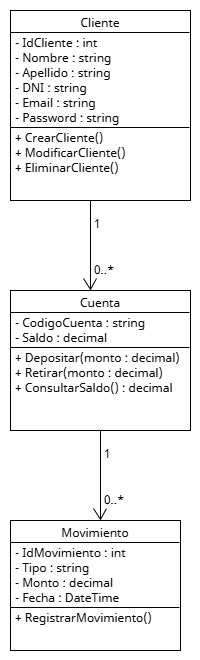

# FintechApp

Proyecto integrador desarrollado en C# utilizando ASP.NET Core MVC.  
El sistema simula una fintech que ofrece servicios bancarios básicos, permitiendo la gestión de clientes, cuentas y movimientos financieros.

---

## 📌 Descripción del proyecto

FintechApp es una aplicación web que permite:
- Registrar y administrar clientes
- Crear cuentas bancarias asociadas a clientes
- Realizar depósitos y retiros
- Consultar el saldo de las cuentas
- Registrar cada movimiento con fecha, tipo y monto

El proyecto fue desarrollado aplicando el paradigma de Programación Orientada a Objetos (POO) y documentado mediante UML.

---

## 🧠 Tecnologías utilizadas

- C#
- ASP.NET Core MVC
- .NET 7 / .NET 8
- HTML5
- CSS
- Razor
- Git y GitHub
- UML (UMLetino)

- ---

## Arquitectura del sistema

El sistema se diseñó utilizando una arquitectura por capas:

- **Dominio**: contiene las entidades del negocio (Cliente, Cuenta, Movimiento).
- **Controllers**: gestionan las solicitudes HTTP.
- **Services**: encapsulan la lógica de la aplicación.
- **Repositories**: abstraen el acceso a los datos.

La estructura fue documentada mediante:
- Diagrama de clases de dominio
- Diagrama de componentes

Los diagramas se encuentran en la carpeta `docs/uml`.

---

## 🧩 Modelo de dominio (POO)

### Clases principales:
- **Cliente**
- **Cuenta**
- **Movimiento**

Relaciones:
- Un cliente puede tener una o varias cuentas
- Una cuenta puede tener múltiples movimientos

---

## 🖥️ Estructura del proyecto
FintechApp
│
├── Controllers
├── Models
├── Views
├── wwwroot
├── Program.cs
├── FintechApp.csproj
└── README.md

## 📐 Diagrama UML

El siguiente diagrama representa el modelo de clases del sistema fintech, diseñado bajo el paradigma de Programación Orientada a Objetos.

---
## Funcionalidades principales
- Registro e inicio de sesión de clientes
- Creación de cuentas
- Depósitos y retiros
- Visualización de movimientos
- Control de sesión

---

## Ejecución del proyecto

1. Clonar el repositorio
2. Abrir la solución en Visual Studio
3. Ejecutar el proyecto
4. Acceder a la aplicación desde el navegador`

---

## 🚀 Estado del proyecto

✔ Etapa 1 – Análisis del problema  
✔ Diseño UML  
✔ Estructura base en ASP.NET Core  
⏳ Implementación de base de datos  
⏳ Autenticación de usuarios  
⏳ Despliegue en la nube  

---

## 📂 Control de versiones

El proyecto utiliza Git para el control de versiones y se encuentra publicado en GitHub, siguiendo buenas prácticas de desarrollo.

---

## 👨‍💻 Autor

**Christian Quiroga**  
Proyecto académico – Curso de Programación
